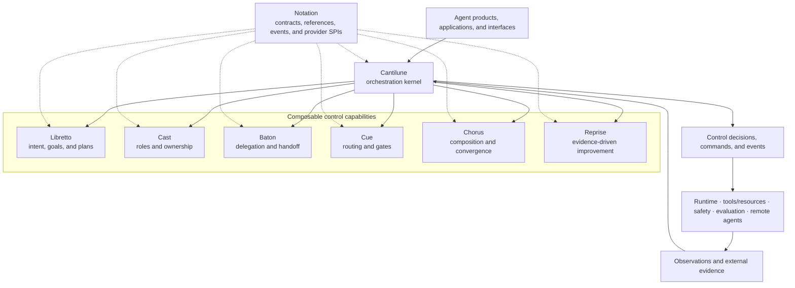

<div align="center">
  
</div>

<div align="center">
  <p><sub>AN ORCHESTRATION PROJECT BY <a href="https://moonweave-ai.github.io/">MOONWEAVE AI</a></sub></p>

  <p>
    
  </p>

  <h1>Cantilune</h1>

  <p>
    <strong>Compose intent into coordinated action.</strong><br>
    <sub>让意向谱成协同行动。</sub>
  </p>

  <p>
    A provider-oriented, ontology-aligned control system for planning, ownership,<br>
    delegation, routing, composition, and evidence-driven improvement across agents.
  </p>

  <p>
    
    
    
    <a href="https://github.com/Moonweave-AI/moonweave-ai-agent-schema">
      
    </a>
    
  </p>

  <p>
    <a href="#vision">Vision</a> ·
    <a href="#why-cantilune">Why Cantilune</a> ·
    <a href="#system-model">System model</a> ·
    <a href="#package-family">Packages</a> ·
    <a href="#landscape-and-positioning">Landscape</a> ·
    <a href="#roadmap">Roadmap</a>
  </p>
</div>

> [!IMPORTANT]
> **Project status: pre-alpha.** Cantilune is entering repository bootstrap and contract design. The package names and architectural boundaries are deliberate, but executable behavior, public APIs, schemas, installation commands, compatibility promises, and release artifacts are not stable yet. This README describes the target architecture and engineering commitments; it does not claim that every described capability is already implemented.

## Vision

Cantilune is the orchestration subsystem of the Moonweave AI agent stack. It turns intent into explicit, inspectable control decisions:

<p align="center">
  <code>Intent → Plan → Ownership → Delegation → Route &amp; Gate → Compose → Improve</code>
</p>

Its central distinction is simple:

> **Cantilune decides what should happen next. Runtime systems execute that decision and report what actually happened.**

The project is designed to make six orchestration capabilities independently usable, replaceable, testable, and researchable while preserving a coherent high-level control model. Applications may use the complete Cantilune distribution, install one capability package, supply a custom provider, or adapt an existing open-source framework.

Cantilune is grounded in the [Moonweave Agent Ontology](https://github.com/Moonweave-AI/moonweave-ai-agent-schema), where control and orchestration are separated from runtime occurrences, tool implementation, safety authorization, evaluation ownership, memory persistence, and user interfaces.

## Why Cantilune

The current agent ecosystem contains strong end-to-end frameworks for model calls, tools, workflows, durable execution, memory, tracing, deployment, and multi-agent collaboration. Those systems optimize for productive application development. Open protocols such as MCP, A2A, and AG-UI standardize adjacent integration boundaries.

Cantilune is intentionally narrower. It optimizes for a different question:

> **Can orchestration decisions remain semantically explicit and independently replaceable, even when the models, runtimes, protocols, tools, and application interfaces change?**

This matters because multi-agent complexity is not automatically useful. Research has identified recurring failures in specification and system design, inter-agent alignment, verification, and termination; newer scaling studies also indicate that the value of coordination depends on task structure, topology, model capability, and overhead. Cantilune therefore treats planning, ownership, delegation, routing, composition, and improvement as inspectable control capabilities rather than hidden behavior inside one agent loop.

### Architectural advantages

These are target architectural properties, not empirical claims of superiority.

| Pressure in agent systems | Cantilune response |
|---|---|
| Planning, routing, execution, and evaluation are frequently collapsed into framework-specific state | Preserve distinct specifications, decisions, commands, observations, and outcomes |
| A useful framework can become an all-or-nothing dependency | Make each orchestration capability an independently installable package behind a shared provider interface |
| Fine-grained repositories create version and governance overhead | Keep eight packages in one monorepo so cross-package changes remain atomic |
| Multi-agent roles are often prompts rather than governed responsibility | Represent role, responsibility, ownership, delegation, and handoff as separate control facts |
| Retry and “reflection” loops can be opaque or unbounded | Make evidence, revision, rerouting, retry, and stop decisions explicit |
| Third-party framework types can leak into the application domain | Confine upstream SDK types to adapters and expose Cantilune contracts at public boundaries |
| Research prototypes drift away from production semantics | Lock implementations to ontology versions and maintain explicit realization and conformance evidence |

## Goals

1. **Explicit control semantics** — model goals, plans, ownership, delegation, routing, gates, composition, and improvement as distinct, versioned concepts.
2. **Composable adoption** — let users install a single capability, use an official profile, or compose native and third-party providers.
3. **Decision–execution separation** — keep orchestration decisions independent of durable execution, persistence, tool invocation, and provider-specific runtime state.
4. **Auditability without private chain of thought** — record observable control facts, references, commands, evidence, and transitions rather than hidden reasoning traces.
5. **Replay and conformance** — make control behavior testable through deterministic transitions, golden traces, contract tests, provider conformance, and compatibility matrices.
6. **Research-friendly evolution** — support alternative planners, routers, coordination mechanisms, workflow topologies, and improvement strategies without rewriting the entire stack.
7. **Standards-aware interoperability** — map to existing frameworks and protocols instead of creating unnecessary replacements for model, tool, transport, UI, or telemetry standards.
8. **Governed change** — evolve public contracts, state machines, ontology mappings, and compatibility guarantees through the Moonweave governance process.

## Non-goals

Cantilune is **not** intended to be:

- a model-provider SDK or prompt framework;
- a tool, resource, or context transport protocol;
- a durable execution engine, scheduler, database, checkpoint store, or deployment platform;
- an evaluation metric registry, benchmark suite, or safety authorization engine;
- a coding agent, research agent, computer-use product, CLI, desktop application, or hosted control plane;
- a universal abstraction that hides every difference between upstream frameworks.

Those systems may sit above, below, or beside Cantilune through explicit ports and providers.

## System model

At the architectural center is an explicit transition protocol:

```text
(current control state, new observation, selected providers)
                         ↓
              orchestration transition
                         ↓
(next control state, decisions, commands, observable events)
```

The deterministic portion of the control kernel should behave like a state transition function. Nondeterministic work—model calls, remote agent interaction, tool execution, human approval, evaluation, storage, and network I/O—belongs behind provider or domain ports and returns as observations.



### Semantic identities that remain distinct

| Cantilune keeps separate | Why the distinction matters |
|---|---|
| `WorkSpecification` and `RunAttempt` | A plan says what should happen; an attempt records what actually happened |
| `CoordinationRole`, `Actor`, and `ResponsibilityAssignment` | A participant, the role it plays, and the responsibility it carries are not interchangeable |
| `ResponsibilityAssignment`, `DelegationDecision`, and `HandoffDecision` | Ownership, work delegation, and transfer of control have different lifecycle and evidence requirements |
| `RoutingPolicy`, `RoutingDecision`, and `ExecutionOutcome` | A policy constrains choice, a decision selects a path, and an outcome reports execution |
| `GateOutcome` and `AuthorizationDecision` | Orchestration may decide whether a path is ready; the safety domain decides whether an action is permitted |
| `EvaluationEvidence` and `ImprovementDecision` | Evaluation defines and produces evidence; orchestration decides whether to revise, retry, reroute, or stop |
| `CompositionSpecification` and composed runtime artifacts | Control owns the composition structure; runtime or information domains own occurrence records and produced content |

## Package family

Cantilune uses **one Git repository and eight independently installable packages**. The first reference implementation is planned as Python-first under the shared `moonweave.cantilune.*` namespace; public schemas and provider contracts should remain language-neutral where practical.

| Project | Planned distribution | Responsibility |
|---|---|---|
| **Cantilune** | `moonweave-cantilune` | High-level orchestration kernel, provider registry, capability composition, profiles, cross-package invariants, compatibility sets, and the official distribution |
| **Cantilune Notation** | `moonweave-cantilune-notation` | Shared references, control commands, observations, events, errors, schemas, capability identifiers, version negotiation, and provider SPIs |
| **Cantilune Libretto** | `moonweave-cantilune-libretto` | Intent, goals, work specifications, task plans, task steps, dependencies, completion criteria, and planning decisions |
| **Cantilune Cast** | `moonweave-cantilune-cast` | Coordination roles, responsibility scopes, answer ownership, control ownership, custody, validity, and assignment evidence |
| **Cantilune Baton** | `moonweave-cantilune-baton` | Delegation requests and decisions, handoff negotiation, acceptance and rejection, and formal control transfer |
| **Cantilune Cue** | `moonweave-cantilune-cue` | Routing policies and decisions, gate conditions and outcomes, retry policies, stop conditions, and next-step selection |
| **Cantilune Chorus** | `moonweave-cantilune-chorus` | Sequential, parallel, hierarchical, voting, merge, synthesis, aggregation, and convergence structures |
| **Cantilune Reprise** | `moonweave-cantilune-reprise` | Evidence-driven revision, replanning, rerouting, retry, escalation, and improvement-loop control |

### Dependency rules

```text
capability packages  ───────►  cantilune-notation
cantilune            ───────►  selected capability packages
providers/adapters   ───────►  cantilune-notation + upstream SDK
capability packages  ──X───►  cantilune high-level package
public APIs          ──X───►  provider-specific internal types
```

The intended invariants are:

- every capability depends on the smallest stable Notation surface it needs;
- capability packages communicate through public references and protocols, not private cross-package imports;
- the high-level Cantilune package composes capabilities but capability packages never depend on it;
- dependency cycles are rejected in CI;
- third-party types remain inside provider packages;
- generated schemas and projections are build outputs, not parallel editable sources.

### Planned installation profiles

Package publication has not started. The intended installation model is:

```bash
# Complete, officially tested distribution
pip install moonweave-cantilune

# One independently usable capability
pip install moonweave-cantilune-cue
```

The high-level distribution is expected to expose tested profiles rather than force every application to install all capabilities:

| Profile | Intended capability set |
|---|---|
| `minimal` | Notation, Libretto, and Cue |
| `collaborative` | Minimal plus Cast and Baton |
| `structured` | Minimal plus Chorus |
| `adaptive` | Structured plus Reprise |
| `full` | All Cantilune capability packages |

Names, dependency extras, and commands remain provisional until the first alpha release.

## Provider model

A Cantilune capability is selected through an explicit provider interface. A provider may be:

- **native** — an implementation maintained in this repository;
- **framework-backed** — an adapter over an open-source framework such as LangGraph, OpenAI Agents SDK, Google ADK, Microsoft Agent Framework, CrewAI, Pydantic AI, or Mastra;
- **protocol-backed** — a remote capability exposed through A2A or another versioned protocol;
- **application-owned** — a domain-specific implementation supplied by the adopter;
- **research** — an experimental algorithm evaluated through the same conformance surface.

Provider selection must remain explicit. Cantilune will not silently switch frameworks, models, policies, or remote agents.

> [!WARNING]
> The following API is an architectural sketch, not a released interface.

```python
from moonweave.cantilune import Orchestrator

orchestrator = Orchestrator(
    planner=planning_provider,
    responsibility=responsibility_provider,
    delegation=delegation_provider,
    routing=routing_provider,
    composition=composition_provider,
    improvement=improvement_provider,
)

transition = await orchestrator.advance(
    state=current_control_state,
    observation=new_observation,
)

transition.next_state
transition.decisions
transition.commands
transition.events
```

The high-level API should spare applications from manually wiring six capability lifecycles while preserving access to each decision and provider boundary.

## One repository, eight packages

The monorepo is a collaboration and evolution boundary—not a monolithic package.

```text
cantilune/
├── packages/
│   ├── notation/
│   ├── libretto/
│   ├── cast/
│   ├── baton/
│   ├── cue/
│   ├── chorus/
│   ├── reprise/
│   └── cantilune/
├── providers/
├── conformance/
├── integration/
├── examples/
├── research/
├── docs/
└── quality/
```

Each package is expected to have its own manifest, source tree, tests, README, API reference, changelog scope, owner path, stability declaration, and build artifact. The monorepo provides:

- atomic changes when a contract revision affects several packages;
- one issue and pull-request system during rapid architectural discovery;
- unified ontology-lock, compatibility, conformance, security, and quality checks;
- path-aware CI and package-level ownership;
- independent package installation and, when justified, independent release versions;
- a clear extraction path if a package later develops an independent community or lifecycle.

The initial release line should use a unified pre-1.0 version. Independent versions should be introduced only after package APIs and change rates genuinely diverge.

## Engineering commitments

Cantilune is intended to be governed by evidence rather than feature claims.

### Control and compatibility

- Pin the ontology version and source commit used by each release.
- Maintain a machine-readable ontology-to-implementation realization map.
- Prefer additive contract evolution; deprecate before removal.
- Publish migration notes for public API, schema, event, and state-machine changes.
- Maintain a tested version set for the high-level distribution.

### Verification

- Unit-test deterministic rules and state transitions.
- Property-test control invariants such as unique ownership, terminal-state behavior, bounded retry, idempotency, and valid handoff transfer.
- Contract-test serialization, unknown fields, enum evolution, and backward-readable events.
- Replay golden control traces as semantic regression tests.
- Run provider conformance suites independently of end-to-end applications.
- Keep stochastic model evaluations separate from deterministic merge gates.

### Boundary discipline

- Treat runtime outcomes, safety authorizations, evaluation evidence, tool results, and memory retrievals as external observations.
- Emit observable decisions and commands; do not persist or expose private chain-of-thought.
- Do not let upstream SDK types become canonical Cantilune contracts.
- Do not create a generic `common`, `core`, or `utils` package as an unowned dependency sink.

## Landscape and positioning

Cantilune is not attempting to out-feature broad agent frameworks. It is designed to complement them with a narrower, package-granular semantic control layer.

> The table below compares each project's documented center of gravity, not maturity, quality, benchmark performance, or total feature coverage. Cantilune is pre-alpha. Landscape descriptions were reviewed against official project documentation in July 2026 and should be periodically refreshed.

| Project | Documented center of gravity | Cantilune relationship |
|---|---|---|
| [LangGraph](https://github.com/langchain-ai/langgraph) | Low-level orchestration and runtime infrastructure for long-running, stateful agents, including durable execution, human intervention, memory, and deployment tooling | A LangGraph provider could realize routing, composition, or runtime ports; Cantilune focuses on explicit cross-capability control semantics rather than durable execution infrastructure |
| [OpenAI Agents SDK](https://github.com/openai/openai-agents-python) | Lightweight multi-agent SDK organized around agents, an agent loop, tools, agents-as-tools, handoffs, guardrails, sessions, and tracing | An adapter could realize delegation, handoff, or execution behavior; Cantilune separates role, responsibility, delegation, and control transfer into distinct contracts |
| [Google ADK](https://github.com/google/adk-python) | Code-first agent framework with a graph workflow runtime, routing, fan-out/fan-in, loops, retry, state, human intervention, and a structured Task API | ADK workflows and tasks could back Cantilune providers; Cantilune aims to preserve provider-neutral decision identities across runtimes |
| [Microsoft Agent Framework](https://github.com/microsoft/agent-framework) | Production-oriented Python and .NET agents and graph workflows with checkpointing, streaming, human intervention, observability, and hosting patterns | Cantilune is not a hosting or deployment framework; it can supply or consume semantic control contracts around workflow implementations |
| [CrewAI](https://github.com/crewAIInc/crewAI) | Role-based collaborative Crews and event-driven Flows for multi-agent automation | Cantilune Cast and Baton formalize role, responsibility, ownership, delegation, and handoff as separate lifecycle facts rather than only agent configuration |
| [Pydantic AI](https://github.com/pydantic/pydantic-ai) | Type-safe, model-agnostic Python agent framework with reusable capabilities, evaluations, graph support, and durable-execution integrations | Cantilune can complement its model and agent layer with domain-specific orchestration packages and provider conformance contracts |
| [Mastra](https://github.com/mastra-ai/mastra) | Batteries-included TypeScript stack for agents, workflows, memory, MCP, evaluations, observability, and application integration | Cantilune is not an application platform; its target is portable orchestration semantics and independently adoptable control capabilities |

### Adjacent protocols and standards

| Standard | Primary boundary | Intended Cantilune relationship |
|---|---|---|
| [Model Context Protocol (MCP)](https://modelcontextprotocol.io/) | Agent or AI application ↔ tools, data, resources, and external workflows | Consume capabilities and evidence through adapters; do not redefine MCP's context and tool integration layer |
| [Agent2Agent Protocol (A2A)](https://a2a-protocol.org/latest/specification/) | Independent agent system ↔ independent agent system | Map remote discovery, task delegation, status, and results into Baton, Cast, and runtime-facing references where semantics align |
| [AG-UI](https://docs.ag-ui.com/introduction) | Agent backend ↔ user-facing application | Export observable Cantilune events and interrupts without turning the UI protocol into the canonical control model |
| [OpenTelemetry Semantic Conventions](https://opentelemetry.io/docs/specs/semconv/) | Cross-platform telemetry names and meanings | Align tracing and correlation metadata while keeping runtime telemetry separate from canonical orchestration decisions |

## Research foundations

Cantilune is an engineering project, not a paper implementation. Its architecture is informed by several research lines and is expected to change as evidence accumulates.

| Theme | Selected references | Design consequence for Cantilune |
|---|---|---|
| Simple, composable agent patterns | [Building Effective Agents](https://www.anthropic.com/engineering/building-effective-agents), [A Survey on Agent Workflow](https://arxiv.org/abs/2508.01186) | Prefer understandable capabilities and explicit composition over a single opaque abstraction |
| Reasoning, planning, and acting | [ReAct](https://arxiv.org/abs/2210.03629), [StateFlow](https://arxiv.org/abs/2403.11322), [LLMCompiler](https://arxiv.org/abs/2312.04511) | Separate process state, plans, dependencies, actions, and parallel scheduling from execution occurrences |
| Roles and collaboration | [CAMEL](https://arxiv.org/abs/2303.17760), [Multi-Agent Collaboration Mechanisms](https://arxiv.org/abs/2501.06322) | Treat actors, roles, structures, strategies, and protocols as different design dimensions |
| Failure analysis and coordination scaling | [Why Do Multi-Agent LLM Systems Fail?](https://arxiv.org/abs/2503.13657), [Towards a Science of Scaling Agent Systems](https://arxiv.org/abs/2512.08296), [Rethinking the Value of Multi-Agent Workflow](https://arxiv.org/abs/2601.12307) | Make specification, alignment, verification, termination, topology, cost, and coordination overhead measurable rather than assuming that more agents are better |
| Iterative feedback and refinement | [Reflexion](https://arxiv.org/abs/2303.11366), [Self-Refine](https://arxiv.org/abs/2303.17651) | Keep feedback evidence separate from the control decision to revise, retry, reroute, escalate, or stop |
| Automated workflow and agent design | [AFlow](https://openreview.net/forum?id=z5uVAKwmjf), [Automated Design of Agentic Systems](https://arxiv.org/abs/2408.08435), [A Survey of Workflow Optimization for LLM Agents](https://arxiv.org/abs/2603.22386) | Let experimental planners and workflow optimizers operate behind stable provider and conformance surfaces |
| Explicit workflow specification | [AgentSPEX](https://arxiv.org/abs/2604.13346) | Keep typed workflow specifications, reusable modules, control state, and runtime implementation separable |
| Evaluation quality | [AI Agents That Matter](https://arxiv.org/abs/2407.01502), [Demystifying Evals for AI Agents](https://www.anthropic.com/engineering/demystifying-evals-for-ai-agents) | Track cost, reproducibility, holdouts, trajectory evidence, and operational outcomes—not accuracy alone |
| Open interoperability and shared semantics | [A2A](https://a2a-protocol.org/latest/specification/), [MCP](https://modelcontextprotocol.io/), [AG-UI](https://docs.ag-ui.com/introduction), [OpenTelemetry Semantic Conventions](https://opentelemetry.io/docs/specs/semconv/) | Reuse established boundaries and naming systems; add mappings rather than gratuitous replacement protocols |

These references are design inputs, not endorsements, dependencies, or claims of equivalent implementation.

## Roadmap

The roadmap is evidence-gated rather than date-gated.

| Milestone | Primary outcome | Exit evidence |
|---|---|---|
| **M0 — Repository bootstrap** *(current)* | Monorepo skeleton, eight package manifests, dependency rules, ontology lock, realization map, ADR/RFC baseline, CI, ownership, and documentation structure | Reproducible workspace build; package-boundary checks; ontology drift check; reviewed architecture decision |
| **M1 — Notation and transition kernel** | Versioned references, commands, observations, events, provider SPIs, errors, serialization, and minimal orchestration state transition | Schema round trips; compatibility tests; deterministic transition tests; one replayable control trace |
| **M2 — First vertical slice** | Libretto and Cue support a goal → plan → route → gate → command → observation → complete/retry loop using fake ports | Golden trace; bounded retry; idempotency; cancellation and failure-path tests; runnable tutorial |
| **M3 — Collaborative control** | Cast and Baton add responsibility assignment, delegation, handoff negotiation, and control transfer | Unique-owner and transfer invariants; rejection and timeout scenarios; provider conformance fixtures |
| **M4 — Structured and adaptive control** | Chorus adds composition and convergence; Reprise consumes external evaluation evidence for revision and stop decisions | Sequential/parallel/merge scenarios; partial-failure tests; evidence provenance; replay and property tests |
| **M5 — Provider ecosystem and first alpha** | Initial framework/protocol providers, tested profiles, package publication, compatibility matrix, reference docs, and examples | Independent package installation; conformance suite; migration policy; signed release artifacts; published limitations |

A milestone is complete only when its behavior, boundaries, tests, documentation, and migration implications are reviewable.

## Documentation and sources of truth

- [Moonweave AI website](https://moonweave-ai.github.io/) — project vision, architecture, research notes, and public roadmap.
- [Moonweave Agent Ontology](https://github.com/Moonweave-AI/moonweave-ai-agent-schema) — canonical semantic source for agent-system concepts and domain ownership.
- [Ontology Explorer](https://moonweave-ai.github.io/moonweave-ai-agent-schema/) — generated visual projection of the canonical ontology source.
- [Moonweave AI Governance](https://github.com/Moonweave-AI/governance) — organizational rules, RFC process, engineering workflow, quality standards, and knowledge-management practices.

Within Cantilune, public contracts and their ontology realization map will be authoritative for implementation behavior. Generated artifacts must always be reproducible from their editable source.

## Contributing

Cantilune is being developed under the [Moonweave AI Governance](https://github.com/Moonweave-AI/governance) model.

Contributions should identify their scope explicitly:

- **implementation change** — internal behavior that preserves public contracts;
- **contract change** — public API, schema, event, provider SPI, or state-machine modification;
- **ontology gap** — implementation evidence that a concept, relation, name, or ownership boundary needs review;
- **provider contribution** — native, framework-backed, protocol-backed, or domain-specific capability implementation;
- **research contribution** — hypothesis, benchmark, experiment, negative result, or reproducibility asset.

Changes to public APIs, protocols, schemas, state machines, domain contracts, cross-package compatibility, or ontology semantics should go through the appropriate RFC or architecture-decision process. Small implementation changes should remain lightweight and use ordinary pull requests.

Repository-specific contribution commands and review paths will be added during M0.

## Security

Do not disclose suspected vulnerabilities, unsafe tool behavior, authorization bypasses, secret exposure, prompt-injection paths, or supply-chain issues in a public issue. Follow the private reporting path defined by the repository's future `SECURITY.md` and the [Moonweave governance security policy](https://github.com/Moonweave-AI/governance/blob/main/SECURITY.md).

Cantilune's orchestration gates must not be represented as safety authorization. High-impact actions still require explicit policy and authorization decisions from the appropriate safety domain or external system.

## Name and visual identity

**Cantilune** is an original coined name evoking song and moonlight: a coordinated performance in which independent voices become one deliberate action.

The package family extends that performance vocabulary:

- **Notation** gives every participant a shared formal language.
- **Libretto** describes intent, goals, and the planned course of work.
- **Cast** identifies roles, responsibility, and ownership.
- **Baton** carries delegation, handoff, and control transfer.
- **Cue** decides when and where control moves next.
- **Chorus** combines independent parts into a convergent whole.
- **Reprise** returns to a task with evidence, revision, and a changed course.

The naming and visual system are original. Repository artwork must be original, commissioned, or used under a clearly compatible license.

## License

Cantilune is intended for an open-source release. The applicable license will be declared in the repository's `LICENSE` file before the first public code release. Until that file is added, no license is granted to copy, modify, or redistribute repository content.

---

<div align="center">
  <p>
    <strong>Moonweave defines how meanings are woven.<br>Cantilune decides how actions move together.</strong>
  </p>
  <p><sub>Moonweave AI · Kaguya Moonweave Project</sub></p>
</div>
