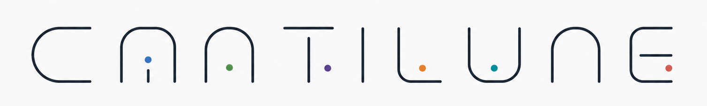
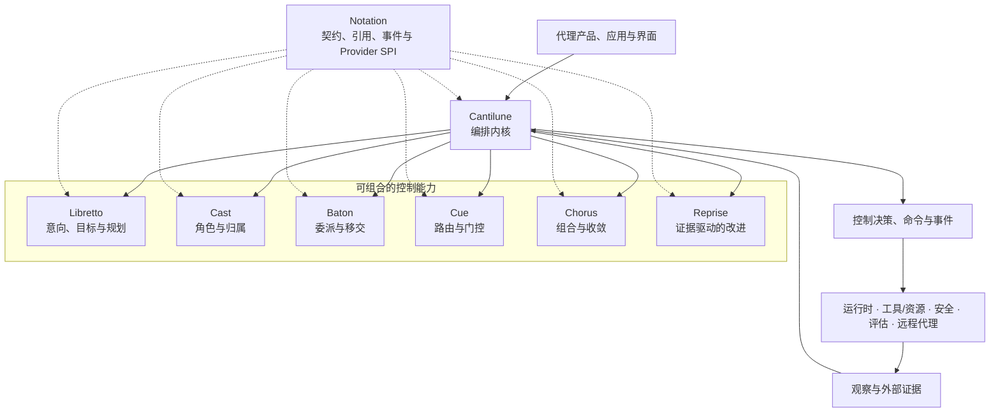

<div align="center">
  
</div>

<div align="center">
  <p><sub>由 <a href="https://moonweave-ai.github.io/">MOONWEAVE AI</a> 出品的编排项目</sub></p>

  <h1>Cantilune</h1>

  <p>
    <strong>将意向谱写为协同行动。</strong><br>
    <sub>Compose intent into coordinated action.</sub>
  </p>

  <p>
    一个面向 Provider、本体对齐的控制系统，用于代理之间的规划、归属、<br>
    委派、路由、组合，以及由证据驱动的改进。
  </p>

  <p>
    
    
    
    <a href="https://github.com/Moonweave-AI/moonweave-ai-agent-schema">
      
    </a>
    
  </p>

  <p>
    <a href="#愿景">愿景</a> ·
    <a href="#为什么是-cantilune">为什么是 Cantilune</a> ·
    <a href="#系统模型">系统模型</a> ·
    <a href="#包家族">包家族</a> ·
    <a href="#生态与定位">生态与定位</a> ·
    <a href="#路线图">路线图</a>
  </p>
</div>

> [!IMPORTANT]
> **项目状态：pre-alpha。** Cantilune 正进入仓库引导与契约设计阶段。包名和架构边界是经过慎重考虑的，但可执行行为、公开 API、Schema、安装命令、兼容性承诺以及发布产物尚不稳定。本 README 描述的是目标架构与工程承诺，并不声称每一项描述的能力都已被实现。

## 愿景

Cantilune 是 Moonweave AI 代理栈中的编排子系统。它将意向转化为显式、可检视的控制决策：

<p align="center">
<code>Intent → Plan → Ownership → Delegation → Route &amp; Gate → Compose → Improve</code>
</p>

它的核心区别很简单：

> **Cantilune 决定下一步该发生什么。运行时系统执行该决策，并上报实际发生了什么。**

该项目旨在让六项编排能力各自可独立使用、可替换、可测试、可研究，同时保持连贯的高层控制模型。应用可以使用完整的 Cantilune 发行版，安装单个能力包，提供自定义 Provider，或适配一个现有的开源框架。

Cantilune 以 [Moonweave Agent Ontology](https://github.com/Moonweave-AI/moonweave-ai-agent-schema) 为基础，其中控制与编排被分离于运行时事件、工具实现、安全授权、评估归属、记忆持久化以及用户界面之外。

## 为什么是 Cantilune

当前的代理生态中，已有强大的端到端框架覆盖模型调用、工具、工作流、持久化执行、记忆、追踪、部署以及多代理协作。这些系统针对高效的应用开发进行了优化。诸如 MCP、A2A、AG-UI 等开放协议则在标准化相邻的集成边界。

Cantilune 有意收窄范围。它针对的是一个不同的问题：

> **即便模型、运行时、协议、工具和应用界面都在变化，编排决策能否始终保持语义显式且可独立替换？**

这一点很重要，因为多代理的复杂性并非天然有用。研究已识别出在规约与系统设计、代理间对齐、验证以及终止上反复出现的失败；更新的规模化研究也表明，协调的价值取决于任务结构、拓扑、模型能力以及开销。因此，Cantilune 将规划、归属、委派、路由、组合与改进视为可检视的控制能力，而非某一个代理循环内隐藏的行为。

### 架构优势

以下为目标架构属性，而非"更优"的经验性主张。

| 代理系统中的压力 | Cantilune 的应对 |
|---|---|
| 规划、路由、执行和评估常被坍缩进框架特定的状态中 | 保留彼此独立的规约、决策、命令、观察与结果 |
| 一个好用的框架可能变成"全有或全无"的依赖 | 让每项编排能力成为共享 Provider 接口之后可独立安装的包 |
| 细粒度仓库会带来版本与治理开销 | 在单一 monorepo 中保留八个包，使跨包改动保持原子性 |
| 多代理的"角色"往往只是 prompt，而非受治理的责任 | 将角色、责任、归属、委派与移交表示为独立的控制事实 |
| 重试与"反思"循环可能不透明或无界 | 让证据、修订、重路由、重试与停止决策显式可见 |
| 第三方框架类型可能泄漏到应用领域 | 将上游 SDK 类型限制在适配器中，在公开边界暴露 Cantilune 契约 |
| 研究原型会偏离生产语义 | 将实现锁定到本体版本，并维护显式的实现与一致性证据 |

## 目标

1. **显式控制语义** — 将目标、规划、归属、委派、路由、门控、组合与改进建模为独立、可版本化的概念。
2. **可组合的采用方式** — 让用户安装单个能力，使用官方 profile，或组合原生与第三方 Provider。
3. **决策—执行分离** — 让编排决策独立于持久化执行、持久化、工具调用以及 Provider 特定的运行时状态。
4. **无需私有思维链的可审计性** — 记录可观察的控制事实、引用、命令、证据与状态迁移，而非隐藏的推理轨迹。
5. **重放与一致性** — 通过确定性状态迁移、黄金轨迹、契约测试、Provider 一致性与兼容性矩阵，让控制行为可测试。
6. **对研究友好的演进** — 支持替代的规划器、路由器、协调机制、工作流拓扑与改进策略，而无需重写整个栈。
7. **面向标准的互操作** — 映射到既有框架与协议，而非为模型、工具、传输、UI 或遥测标准制造不必要的替代品。
8. **受治理的变更** — 通过 Moonweave 治理流程演进公开契约、状态机、本体映射与兼容性承诺。

## 非目标

Cantilune **并不**打算成为：

- 一个模型 Provider SDK 或提示词框架；
- 一个工具、资源或上下文传输协议；
- 一个持久化执行引擎、调度器、数据库、检查点存储或部署平台；
- 一个评估指标注册表、基准套件或安全授权引擎；
- 一个编码代理、研究代理、计算机使用产品、CLI、桌面应用或托管控制面；
- 一个抹平上游框架之间所有差异的通用抽象。

这些系统可以通过显式的端口与 Provider 位于 Cantilune 之上、之下或之旁。

## 系统模型

架构中心是一个显式的状态迁移协议：

```text
(当前控制状态, 新观察, 选定的 providers)
                         ↓
              编排迁移 (orchestration transition)
                         ↓
(下一控制状态, 决策, 命令, 可观察事件)
```

控制内核的确定性部分应表现得像一个状态迁移函数。非确定性工作——模型调用、远程代理交互、工具执行、人工审批、评估、存储与网络 I/O——位于 Provider 或领域端口之后，并作为观察返回。



### 保持独立的语义身份

| Cantilune 予以区分 | 区分为何重要 |
|---|---|
| `WorkSpecification` 与 `RunAttempt` | 规划说的是"该发生什么"；尝试记录的是"实际发生了什么" |
| `CoordinationRole`、`Actor` 与 `ResponsibilityAssignment` | 参与者、其扮演的角色、其承担的责任三者不可互换 |
| `ResponsibilityAssignment`、`DelegationDecision` 与 `HandoffDecision` | 归属、工作委派与控制移交有不同的生命周期与证据要求 |
| `RoutingPolicy`、`RoutingDecision` 与 `ExecutionOutcome` | 策略约束选择，决策选定路径，结果上报执行 |
| `GateOutcome` 与 `AuthorizationDecision` | 编排可以决定某条路径是否就绪；安全域决定某个动作是否被允许 |
| `EvaluationEvidence` 与 `ImprovementDecision` | 评估定义并产出证据；编排决定是否修订、重试、重路由或停止 |
| `CompositionSpecification` 与组合出的运行时产物 | 控制拥有组合结构；运行时或信息域拥有事件记录与产出内容 |

## 包家族

Cantilune 采用**一个 Git 仓库、八个可独立安装的包**。首个参考实现计划以 Python 优先，置于共享的 `moonweave.cantilune.*` 命名空间下；公开的 Schema 与 Provider 契约在可行之处应保持语言中立。

| 项目 | 计划的发行物 | 职责 |
|---|---|---|
| **Cantilune** | `moonweave-cantilune` | 高层编排内核、Provider 注册表、能力组合、profile、跨包不变量、兼容集与官方发行版 |
| **Cantilune Notation** | `moonweave-cantilune-notation` | 共享引用、控制命令、观察、事件、错误、Schema、能力标识符、版本协商与 Provider SPI |
| **Cantilune Libretto** | `moonweave-cantilune-libretto` | 意向、目标、工作规约、任务规划、任务步骤、依赖、完成准则与规划决策 |
| **Cantilune Cast** | `moonweave-cantilune-cast` | 协调角色、责任范围、答案归属、控制归属、监护、有效性与指派证据 |
| **Cantilune Baton** | `moonweave-cantilune-baton` | 委派请求与决策、移交协商、接受与拒绝，以及正式的控制权移交 |
| **Cantilune Cue** | `moonweave-cantilune-cue` | 路由策略与决策、门控条件与结果、重试策略、停止条件与下一步选择 |
| **Cantilune Chorus** | `moonweave-cantilune-chorus` | 顺序、并行、分层、投票、合并、合成、聚合与收敛结构 |
| **Cantilune Reprise** | `moonweave-cantilune-reprise` | 证据驱动的修订、重规划、重路由、重试、升级与改进循环控制 |

### 依赖规则

```text
能力包   ───────►  cantilune-notation
cantilune            ───────►  选定的能力包
providers/adapters   ───────►  cantilune-notation + 上游 SDK
能力包  ──X───►  cantilune 高层包
公开 API ──X───►  Provider 特定的内部类型
```

预期的不变量为：

- 每个能力仅依赖它所需的最小稳定 Notation 表面；
- 能力包通过公开引用与协议通信，而非私有的跨包导入；
- 高层 Cantilune 包组合能力，但能力包从不依赖它；
- CI 中拒绝依赖环；
- 第三方类型停留在 Provider 包内部；
- 生成的 Schema 与投影是构建产物，不是可并行编辑的源文件。

### 计划的安装 profile

包发布尚未开始。预期的安装方式为：

```bash
# 完整、经官方测试的发行版
pip install moonweave-cantilune

# 一个可独立使用的能力
pip install moonweave-cantilune-cue
```

高层发行版预期会公开经测试的 profile，而非强迫每个应用安装全部能力：

| Profile | 预期能力集 |
|---|---|
| `minimal` | Notation、Libretto 与 Cue |
| `collaborative` | Minimal 加上 Cast 与 Baton |
| `structured` | Minimal 加上 Chorus |
| `adaptive` | Structured 加上 Reprise |
| `full` | 全部 Cantilune 能力包 |

名称、依赖 extras 与命令在首个 alpha 版本前仍属临时性。

## Provider 模型

一项 Cantilune 能力通过显式的 Provider 接口被选定。Provider 可以是：

- **native** — 本仓库维护的实现；
- **framework-backed** — 对开源框架的适配，如 LangGraph、OpenAI Agents SDK、Google ADK、Microsoft Agent Framework、CrewAI、Pydantic AI 或 Mastra；
- **protocol-backed** — 通过 A2A 或其他版本化协议暴露的远程能力；
- **application-owned** — 采用方提供的领域特定实现；
- **research** — 通过同一一致性界面评估的实验性算法。

Provider 的选定必须保持显式。Cantilune 不会静默切换框架、模型、策略或远程代理。

> [!WARNING]
> 以下 API 是架构草图，而非已发布接口。

```python
from moonweave.cantilune import Orchestrator

orchestrator = Orchestrator(
    planner=planning_provider,
    responsibility=responsibility_provider,
    delegation=delegation_provider,
    routing=routing_provider,
    composition=composition_provider,
    improvement=improvement_provider,
)

transition = await orchestrator.advance(
    state=current_control_state,
    observation=new_observation,
)

transition.next_state
transition.decisions
transition.commands
transition.events
```

高层 API 应让应用免于手工编排六项能力的生命周期，同时仍能访问每一项决策与 Provider 边界。

## 一个仓库，八个包

该 monorepo 是协作与演进的边界——而非一个单体包。

```text
cantilune/
├── packages/
│   ├── notation/
│   ├── libretto/
│   ├── cast/
│   ├── baton/
│   ├── cue/
│   ├── chorus/
│   ├── reprise/
│   └── cantilune/
├── providers/
├── conformance/
├── integration/
├── examples/
├── research/
├── docs/
└── quality/
```

每个包预期拥有自己的清单、源码树、测试、README、API 参考、changelog 范围、owner 路径、稳定性声明与构建产物。该 monorepo 提供：

- 当一次契约修订影响多个包时，进行原子化改动；
- 在快速架构探索期间，统一的 issue 与 pull-request 系统；
- 统一的本体锁定、兼容性、一致性、安全与质量检查；
- 路径感知的 CI 与包级 ownership；
- 独立的包安装，并在有正当理由时支持独立的发布版本；
- 当某个包日后形成独立社区或生命周期时，清晰的抽离路径。

首发线应使用统一的 pre-1.0 版本。仅当各包 API 与变更速率真正出现分歧时，才引入独立版本。

## 工程承诺

Cantilune 旨在由证据而非功能主张来治理。

### 控制与兼容性

- 为每次发布锁定其使用的本体版本与源码 commit。
- 维护机器可读的本体到实现的映射（realization map）。
- 优先采用累加式契约演进；移除之前先弃用。
- 为公开 API、Schema、事件与状态机的变更发布迁移说明。
- 为高层发行版维护经测试的版本集。

### 验证

- 对确定性规则与状态迁移做单元测试。
- 对控制不变量做属性测试，如唯一归属、终态行为、有界重试、幂等性与有效移交。
- 对序列化、未知字段、枚举演进与向后可读事件做契约测试。
- 将黄金控制轨迹作为语义回归测试进行重放。
- 独立于端到端应用运行 Provider 一致性套件。
- 将随机性模型评估与确定性合并门控分开。

### 边界纪律

- 将运行时结果、安全授权、评估证据、工具结果与记忆检索视为外部观察。
- 发出可观察的决策与命令；不持久化或暴露私有思维链。
- 不让上游 SDK 类型成为 Cantilune 的规范契约。
- 不创建一个通用的 `common`、`core` 或 `utils` 包作为无人拥有的依赖沉淀池。

## 生态与定位

Cantilune 并不试图在功能广度上超越大型代理框架。它被设计为用一个更窄、包粒度的语义控制层来补充它们。

> 下表比较的是各项目文档所记录的"重心"，而非成熟度、质量、基准性能或功能总覆盖。Cantilune 处于 pre-alpha。生态描述于 2026 年 7 月对照各项目官方文档审阅，应定期刷新。

| 项目 | 文档记录的重心 | 与 Cantilune 的关系 |
|---|---|---|
| [LangGraph](https://github.com/langchain-ai/langgraph) | 面向长时间运行、有状态代理的低层编排与运行时基础设施，含持久化执行、人工介入、记忆与部署工具 | 一个 LangGraph Provider 可实现路由、组合或运行时端口；Cantilune 聚焦于显式的跨能力控制语义，而非持久化执行基础设施 |
| [OpenAI Agents SDK](https://github.com/openai/openai-agents-python) | 围绕代理、代理循环、工具、代理即工具、移交、护栏、会话与追踪组织的轻量多代理 SDK | 一个适配器可实现委派、移交或执行行为；Cantilune 将角色、责任、委派与控制移交拆分为独立的契约 |
| [Google ADK](https://github.com/google/adk-python) | 代码优先的代理框架，含图工作流运行时、路由、扇出/扇入、循环、重试、状态、人工介入与结构化 Task API | ADK 工作流与任务可支撑 Cantilune Provider；Cantilune 旨在跨运行时保持 Provider 中立的决策身份 |
| [Microsoft Agent Framework](https://github.com/microsoft/agent-framework) | 面向生产的 Python 与 .NET 代理及图工作流，含检查点、流式、人工介入、可观测性与托管模式 | Cantilune 不是托管或部署框架；它可在工作流实现周围提供或消费语义控制契约 |
| [CrewAI](https://github.com/crewAIInc/crewAI) | 基于角色的协作 Crew 与事件驱动 Flow，用于多代理自动化 | Cantilune Cast 与 Baton 将角色、责任、归属、委派与移交形式化为独立的生命周期事实，而非仅仅是代理配置 |
| [Pydantic AI](https://github.com/pydantic/pydantic-ai) | 类型安全、模型无关的 Python 代理框架，含可复用能力、评估、图支持与持久化执行集成 | Cantilune 可用领域特定的编排包与 Provider 一致性契约来补充其模型与代理层 |
| [Mastra](https://github.com/mastra-ai/mastra) | 面向代理、工作流、记忆、MCP、评估、可观测性与应用集成的"全家桶" TypeScript 栈 | Cantilune 不是应用平台；其目标是可移植的编排语义与可独立采用的控制能力 |

### 相邻协议与标准

| 标准 | 主要边界 | Cantilune 预期关系 |
|---|---|---|
| [Model Context Protocol (MCP)](https://modelcontextprotocol.io/) | 代理或 AI 应用 ↔ 工具、数据、资源与外部工作流 | 通过适配器消费能力与证据；不重新定义 MCP 的上下文与工具集成层 |
| [Agent2Agent Protocol (A2A)](https://a2a-protocol.org/latest/specification/) | 独立代理系统 ↔ 独立代理系统 | 在语义对齐之处，将远程发现、任务委派、状态与结果映射进 Baton、Cast 与面向运行时的引用 |
| [AG-UI](https://docs.ag-ui.com/introduction) | 代理后端 ↔ 面向用户的应用 | 导出可观察的 Cantilune 事件与中断，而不把 UI 协议变成规范控制模型 |
| [OpenTelemetry Semantic Conventions](https://opentelemetry.io/docs/specs/semconv/) | 跨平台遥测的命名与含义 | 对齐追踪与关联元数据，同时将运行时遥测与规范编排决策分开 |

## 研究基础

Cantilune 是一个工程项目，而非某篇论文的实现。其架构受若干研究脉络启发，并会随证据积累而演进。

| 主题 | 精选参考 | 对 Cantilune 的设计后果 |
|---|---|---|
| 简单、可组合的代理模式 | [Building Effective Agents](https://www.anthropic.com/engineering/building-effective-agents)、[A Survey on Agent Workflow](https://arxiv.org/abs/2508.01186) | 优先选择可理解的能力与显式组合，而非单一不透明的抽象 |
| 推理、规划与行动 | [ReAct](https://arxiv.org/abs/2210.03629)、[StateFlow](https://arxiv.org/abs/2403.11322)、[LLMCompiler](https://arxiv.org/abs/2312.04511) | 将过程状态、规划、依赖、动作与并行调度与执行事件分离 |
| 角色与协作 | [CAMEL](https://arxiv.org/abs/2303.17760)、[Multi-Agent Collaboration Mechanisms](https://arxiv.org/abs/2501.06322) | 将参与者、角色、结构、策略与协议视为不同的设计维度 |
| 失败分析与协调规模化 | [Why Do Multi-Agent LLM Systems Fail?](https://arxiv.org/abs/2503.13657)、[Towards a Science of Scaling Agent Systems](https://arxiv.org/abs/2512.08296)、[Rethinking the Value of Multi-Agent Workflow](https://arxiv.org/abs/2601.12307) | 让规约、对齐、验证、终止、拓扑、成本与协调开销可度量，而非默认"代理越多越好" |
| 迭代反馈与精炼 | [Reflexion](https://arxiv.org/abs/2303.11366)、[Self-Refine](https://arxiv.org/abs/2303.17651) | 将反馈证据与"是否修订、重试、重路由、升级或停止"的控制决策分开 |
| 自动化工作流与代理设计 | [AFlow](https://openreview.net/forum?id=z5uVAKwmjf)、[Automated Design of Agentic Systems](https://arxiv.org/abs/2408.08435)、[A Survey of Workflow Optimization for LLM Agents](https://arxiv.org/abs/2603.22386) | 让实验性规划器与工作流优化器在稳定的 Provider 与一致性表面之后运行 |
| 显式工作流规约 | [AgentSPEX](https://arxiv.org/abs/2604.13346) | 让有类型的工作流规约、可复用模块、控制状态与运行时实现保持可分离 |
| 评估质量 | [AI Agents That Matter](https://arxiv.org/abs/2407.01502)、[Demystifying Evals for AI Agents](https://www.anthropic.com/engineering/demystifying-evals-for-ai-agents) | 追踪成本、可复现性、holdout、轨迹证据与运营结果——而非仅准确率 |
| 开放互操作与共享语义 | [A2A](https://a2a-protocol.org/latest/specification/)、[MCP](https://modelcontextprotocol.io/)、[AG-UI](https://docs.ag-ui.com/introduction)、[OpenTelemetry Semantic Conventions](https://opentelemetry.io/docs/specs/semconv/) | 复用既有边界与命名系统；增加映射，而非无谓地另起替代协议 |

这些参考是设计输入，而非背书、依赖或"等效实现"的主张。

## 路线图

该路线图以证据为门控，而非以日期为门控。

| 里程碑 | 主要产出 | 退出证据 |
|---|---|---|
| **M0 — 仓库引导** *(当前)* | Monorepo 骨架、八个包清单、依赖规则、本体锁定、realization map、ADR/RFC 基线、CI、ownership 与文档结构 | 可复现的工作区构建；包边界检查；本体漂移检查；经评审的架构决策 |
| **M1 — Notation 与迁移内核** | 版本化引用、命令、观察、事件、Provider SPI、错误、序列化与最小编排状态迁移 | Schema 往返；兼容性测试；确定性迁移测试；一条可重放的控制轨迹 |
| **M2 — 首个纵向切片** | Libretto 与 Cue 支撑一个 目标 → 规划 → 路由 → 门控 → 命令 → 观察 → 完成/重试 的闭环，使用 fake 端口 | 黄金轨迹；有界重试；幂等性；取消与失败路径测试；可运行教程 |
| **M3 — 协作控制** | Cast 与 Baton 增加责任指派、委派、移交协商与控制权移交 | 唯一归属与移交不变量；拒绝与超时场景；Provider 一致性夹具 |
| **M4 — 结构化与自适应控制** | Chorus 增加组合与收敛；Reprise 消费外部评估证据以驱动修订与停止决策 | 顺序/并行/合并场景；部分失败测试；证据溯源；重放与属性测试 |
| **M5 — Provider 生态与首个 alpha** | 初始框架/协议 Provider、经测试的 profile、包发布、兼容性矩阵、参考文档与示例 | 独立包安装；一致性套件；迁移策略；签名发布产物；已公开的限制 |

只有当某个里程碑的行为、边界、测试、文档与迁移影响均可评审时，才算完成。

## 文档与事实来源

- [Moonweave AI 网站](https://moonweave-ai.github.io/) — 项目愿景、架构、研究笔记与公开路线图。
- [Moonweave Agent Ontology](https://github.com/Moonweave-AI/moonweave-ai-agent-schema) — 代理系统概念与领域归属的规范语义来源。
- [Ontology Explorer](https://moonweave-ai.github.io/moonweave-ai-agent-schema/) — 规范本体来源的生成式可视化投影。
- [Moonweave AI Governance](https://github.com/Moonweave-AI/governance) — 组织规则、RFC 流程、工程工作流、质量标准与知识管理实践。

在 Cantilune 内，公开契约及其本体 realization map 对实现行为具有权威性。生成产物必须始终可从其可编辑源文件复现。

## 贡献

Cantilune 在 [Moonweave AI Governance](https://github.com/Moonweave-AI/governance) 模型下开发。

贡献应明确标示其范围：

- **实现变更** — 保留公开契约的内部行为；
- **契约变更** — 对公开 API、Schema、事件、Provider SPI 或状态机的修改；
- **本体缺口** — 表明某概念、关系、名称或归属边界需要评审的实现证据；
- **Provider 贡献** — native、framework-backed、protocol-backed 或领域特定的能力实现；
- **研究贡献** — 假设、基准、实验、阴性结果或可复现性资产。

对公开 API、协议、Schema、状态机、领域契约、跨包兼容性或本体语义的变更，应通过相应的 RFC 或架构决策流程进行。小的实现变更应保持轻量，使用普通 pull request。

仓库特定的贡献命令与评审路径将在 M0 期间补充。

## 安全

请勿在公开 issue 中披露疑似漏洞、不安全的工具行为、授权绕过、密钥暴露、prompt injection 路径或供应链问题。请遵循仓库未来的 `SECURITY.md` 以及 [Moonweave 治理安全策略](https://github.com/Moonweave-AI/governance/blob/main/SECURITY.md) 所定义的私下报告路径。

Cantilune 的编排门控不得被表述为安全授权。高影响动作仍需来自相应安全域或外部系统的显式策略与授权决策。

## 名称与视觉识别

**Cantilune** 是一个原创的造词，唤起歌曲与月光：一场协调的演出，让独立的声部成为一次审慎的行动。

包家族延续了这一演出语汇：

- **Notation** 给每位参与者一套共享的形式化语言。
- **Libretto** 描述意向、目标与计划的工作进程。
- **Cast** 标识角色、责任与归属。
- **Baton** 承载委派、移交与控制权转移。
- **Cue** 决定控制下一步何时、去往何处。
- **Chorus** 将独立声部合成一个收敛的整体。
- **Reprise** 带着证据、修订与改变的进程回到任务。

命名与视觉系统均为原创。仓库美术作品必须原创、委托创作，或在明确兼容的许可下使用。

## 许可证

Cantilune 计划以开源方式发布。适用的许可证将在首次公开代码发布前于仓库的 `LICENSE` 文件中声明。在该文件加入之前，未授予任何复制、修改或再分发仓库内容的许可。

---

<div align="center">
  <p>
    <strong>Moonweave 定义意义如何被编织。<br>Cantilune 决定行动如何一同前行。</strong>
  </p>
  <p>
    
  </p>
  <p><sub>Moonweave AI · Kaguya Moonweave Project</sub></p>
</div>
