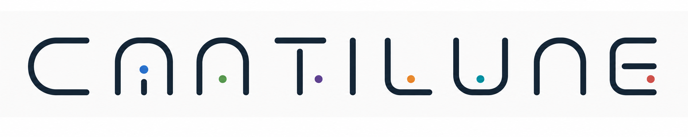
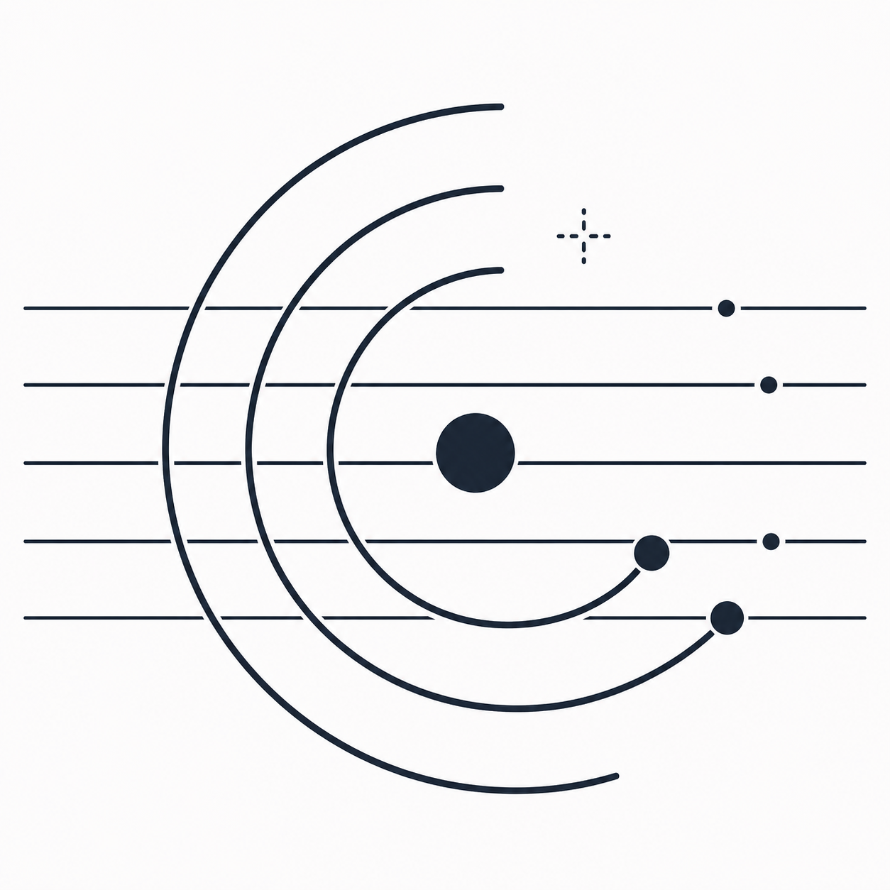

<div align="center">
  

  <h1>Cantilune</h1>

  <p><strong>让意图成为可见、可演化、可验证的协同行动。</strong></p>
  <p><sub>Compose intent into visible, evolvable coordination.</sub></p>

  <p>
    
    
    
    <a href="https://github.com/Moonweave-AI/cantilune/actions/workflows/formal.yml?query=branch%3Acodex%2Ftheory-foundation">
      
    </a>
  </p>

  <p><a href="../README.md">English</a> · 简体中文</p>
</div>

> [!IMPORTANT]
> **Cantilune 是 0.x。** Owner 已接受本轮工程发布（Apache-2.0，npm 0.x）。
> **没有**稳定 API / schema / 兼容承诺。Lean 内核为 `proved / Owner-accepted`
> （义务行保持 `proved`；未走 promotion form）。Owner 已以 COI 签署治理形式化 /
> QA-L5 / AI-Eval。不设第二评审人。`@cantilune/conformance` 为 0.x 生产发布权限。
> RFC-0001–0004 处于 **FCP open**（2026-08-16 → 2026-08-30），不是 Accepted。
> 下文标为 `†` 的能力是形式目标，不是已测优越性。

## 项目目标

Cantilune 是一个面向 **通用 agent 编排** 的语言与控制底座构想。它希望在同一
个可检视模型中协调 agent、工具、人员、服务、权限、会话与稀缺资源。

单个 agent 很强，并不自动意味着系统很强。当多个 agent 共同工作时，困难往往
来自协同本身：

- 谁可以执行什么操作，持有哪些预算、锁、凭据或审批？
- 谁负责一项工作；何时委派、接受、拒绝或升级？
- 哪些对话属于私有会话；何时可以转移会话或能力？
- 协同图发生了什么变化，为什么该变化有效，能否重放？

现有框架已经显著降低了构建实用 agent 工作流的门槛。Cantilune 希望补足的是
语义层：使拓扑、权限、资源、协议与反馈成为一等对象，而非隐藏在提示词、回调
和可变状态中的约定。

```text
意图与约束
        → 可见的协同图
        → 类型化组合 + 协议 + 授权 + 资源检查
        → agents + 工具 + 人员 + 服务 + 外部系统
        → 具名事件 + 重放 + 反馈 + 受控重构
```

这里的“任意编排”并不是任意的无类型副作用；它是指任何满足已声明契约的拓扑或
协议，都可以被构造、组合和变更。

## 数学模型

语义目标是一个重写系统：

$$
  \mathsf{CantiluneGraph}=(\mathcal C,\mathcal R),
$$

其中 $\mathcal C$ 描述合法组合， $\mathcal R$ 描述带身份的重构事件。
数学是内部内核：它应当让编排更容易理解、检视和控制，而不是要求应用作者书写
范畴论。

| 组成部分                    | 编排中的含义                             | 它保护或解释的事物                         |
| --------------------------- | ---------------------------------------- | ------------------------------------------ |
| 自由对称幺半范畴            | 类型化的串行、并行和重连组合             | 非法连接与隐式复制/丢弃可与合法组合区分    |
| 类型开放超图与 DPOI 重写    | 添加、替换、重连或删除协同子图           | 变更具有显式的边界、新鲜性、悬挂与静默条件 |
| Late $\pi$-演算             | 创建、隐藏、转移和关闭通信会话           | 委派与交接是协议，而不只是共享状态变更     |
| individual-token Petri 语义 | 表示唯一权限、配额、锁、预算和会话 token | 权限与资源不能被静默复制或消失             |
| FMS 风格的指称研究分支      | 为已支持的并发行为给出组合性解释         | 在已记录的范围内关联操作语义与指称视图     |
| 投影证书                    | 关联图、依赖、资源、通信与身份视图       | 一个源事件具有对应目标事件和可重放身份     |

对一个通过证书的事件 $e$，预期的一致性条件为：

$$
  C \xrightarrow{e} C'
  \quad\Longrightarrow\quad
  P_i(C)\xrightarrow{\Phi_i(e)}P_i(C')
  \qquad
  (i\in\{\mathrm{DAG},\mathrm{Petri},\pi,\mathrm{morphism}\}).
$$

换言之，事件并不是事后恰好一致的四块仪表盘；它是一个有身份的变更，并在四个
有用视图中各有原生对应。

## 用户应当能看见什么

| 视图           | 所回答的问题                                                 |
| -------------- | ------------------------------------------------------------ |
| 协同结构       | 此刻连接了哪些 agent、工具、人员和服务？发生了什么增删？     |
| 依赖视图       | 什么可以运行、被阻塞、成环、完成，或正在等待外部输入？       |
| 资源与授权视图 | 谁持有唯一权限、预算、锁、会话或审批？                       |
| 通信视图       | 谁把什么委派给谁，在哪个会话中，以何种确认完成？             |
| 重放与反馈视图 | 哪些确切事件导致当前状态，收到了哪些证据，为什么选择下一步？ |

LLM 说“完成”本身并不等于协议转换已经完成。成功、拒绝、等待、死锁和可生产的
无限运行是不同状态。

## 编排框架生态对比

下表是范围对比，**不是基准测试**。横轴只包含编排框架，不包含编码 agent 产品。
标记来自截至 2026-07-28 所查阅的官方文档：

- `✓`：文档中明确的一等能力或主要设计目标；
- `△`：可通过集成、自定义组合或相邻能力实现，但并非同一种一等语义保证；
- `✗`：所查阅资料中没有作为主要保证的记载；
- `✓†`：Cantilune 已声明的形式化目标，尚非已发布运行时能力。

| 能力 / 主要范围                        | [LangChain](https://docs.langchain.com/oss/python/langchain/multi-agent/) | [LangGraph](https://docs.langchain.com/oss/python/langgraph/overview) | [CrewAI](https://docs.crewai.com/) | [AutoGen](https://microsoft.github.io/autogen/stable/) | [OpenAI<br>Agents SDK](https://openai.github.io/openai-agents-python/agents/) | [Google<br>ADK](https://adk.dev/) | [Pydantic<br>AI](https://pydantic.dev/docs/ai/overview/) | [Mastra](https://mastra.ai/ai-workflows) | [Microsoft Agent<br>Framework](https://learn.microsoft.com/en-us/agent-framework/) | **Cantilune** |
| -------------------------------------- | :-----------------------------------------------------------------------: | :-------------------------------------------------------------------: | :--------------------------------: | :----------------------------------------------------: | :---------------------------------------------------------------------------: | :-------------------------------: | :------------------------------------------------------: | :--------------------------------------: | :--------------------------------------------------------------------------------: | :-----------: |
| 通用 agent / 工作流编排                |                                     ✓                                     |                                   ✓                                   |                 ✓                  |                           ✓                            |                                       ✓                                       |                 ✓                 |                            ✓                             |                    ✓                     |                                         ✓                                          |      ✓†       |
| 显式工作流拓扑：分支、循环、并行       |                                     △                                     |                                   ✓                                   |                 ✓                  |                           ✓                            |                                       △                                       |                 ✓                 |                            ✓                             |                    ✓                     |                                         ✓                                          |      ✓†       |
| 多 agent 团队、路由、委派或交接        |                                     ✓                                     |                                   ✓                                   |                 ✓                  |                           ✓                            |                                       ✓                                       |                 ✓                 |                            △                             |                    ✓                     |                                         ✓                                          |      ✓†       |
| 持久状态、暂停/恢复或人工审批          |                                     △                                     |                                   ✓                                   |                 ✓                  |                           △                            |                                       △                                       |                 ✓                 |                            ✓                             |                    ✓                     |                                         ✓                                          |      ✓†       |
| 模型、工具与 MCP 集成                  |                                     ✓                                     |                                   ✓                                   |                 ✓                  |                           ✓                            |                                       ✓                                       |                 ✓                 |                            ✓                             |                    ✓                     |                                         ✓                                          |      ✓†       |
| trace、日志或执行可观测性              |                                     △                                     |                                   ✓                                   |                 ✓                  |                           △                            |                                       ✓                                       |                 ✓                 |                            ✓                             |                    ✓                     |                                         ✓                                          |      ✓†       |
| 与 provider 无关的**语义**组合演算     |                                     ✗                                     |                                   ✗                                   |                 ✗                  |                           ✗                            |                                       ✗                                       |                 ✗                 |                            ✗                             |                    ✗                     |                                         ✗                                          |      ✓†       |
| 原生的有作用域会话与可转移通道         |                                     ✗                                     |                                   ✗                                   |                 ✗                  |                           △                            |                                       △                                       |                 ✗                 |                            ✗                             |                    ✗                     |                                         ✗                                          |      ✓†       |
| 唯一资源与授权的线性语义               |                                     ✗                                     |                                   ✗                                   |                 ✗                  |                           ✗                            |                                       ✗                                       |                 ✗                 |                            ✗                             |                    ✗                     |                                         ✗                                          |      ✓†       |
| 受结构、资源和授权条件约束的动态图变更 |                                     ✗                                     |                                   △                                   |                 ✗                  |                           △                            |                                       ✗                                       |                 △                 |                            △                             |                    △                     |                                         △                                          |      ✓†       |
| 单一事件同步于图、依赖、资源与协议视图 |                                     ✗                                     |                                   ✗                                   |                 ✗                  |                           ✗                            |                                       ✗                                       |                 ✗                 |                            ✗                             |                    ✗                     |                                         ✗                                          |      ✓†       |
| 具名重构事件的语义重放                 |                                     ✗                                     |                                   △                                   |                 △                  |                           △                            |                                       △                                       |                 △                 |                            △                             |                    △                     |                                         △                                          |      ✓†       |
| 已发布运行时、生态与生产实践           |                                     ✓                                     |                                   ✓                                   |                 ✓                  |                           ✓                            |                                       ✓                                       |                 ✓                 |                            ✓                             |                    ✓                     |                                         ✓                                          |       ✗       |

现有框架在工作流运行时层已经非常成熟。LangGraph 侧重有状态图、持久执行、流式
输出、人工介入和长程 agent；Google ADK 提供图与多 agent 工作流、会话、可观测性、
评估以及 A2A/MCP 集成；Mastra 提供类型化工作流步骤、持久状态、分支、并行与 trace。
Cantilune 的设计是围绕此类运行时增加共同的协同模型。

Cantilune 的语义重点则不同：**拓扑变更、通信作用域、排他授权与重放本身都是
编排语义的对象。**它补充的是 agent 角色、提示词、工具和工作流 API 之上的协同层。

## 协调专业化 agent

Cantilune 面向对 [Claude Code](https://code.claude.com/docs/)、
[OpenAI Codex](https://openai.com/codex/) 和
[OpenCode](https://opencode.ai/docs/agents) 等专业 agent 的协同，也可同时连接研究
agent、审查 agent、工具、服务与人工参与者。每个参与者保留自身专长；Cantilune
记录责任、权限、会话和证据如何在参与者之间流动。

在软件任务中，编码 agent 可以实现变更，审查者检查结果，研究者提供证据，而人类
为高影响动作保留审批权：

```text
目标、策略、预算、所有权
               │
               ▼
        Cantilune 协同图
     ┌─────────┼──────────┐
     ▼         ▼          ▼
研究 agent  编码 agent   审查 agent / 人类
           （Codex、
            Claude Code、
            OpenCode 等）
     └─────────┼──────────┘
               ▼
证据、审批、资源释放与可重放的结果
```

Cantilune 提供共同的系统上下文：清晰的所有权、受限的权限、显式协同协议、安全并行
工作、受控交接以及可见地改变协同图的反馈。

## 一页架构

```text
意图 + 目标 + 角色 + 策略
              │
              ▼
类型化协同图 ── 重构事件 ── 证书与重放
              │
              ├── 依赖 / 调度视图
              ├── 资源 + 授权视图
              ├── 会话 + 委派视图
              └── 反馈 + 证据视图
              │
              ▼
agents · 编码 agents · 工具 · MCP/A2A 服务 · 人员 · 外部系统
```

计划中的公开能力族彼此可分离：

| 能力         | 关注点                                              |
| ------------ | --------------------------------------------------- |
| **Notation** | 共享引用、命令、观察、事件、schema 与 provider 边界 |
| **Libretto** | 意图、目标、计划、依赖与完成条件                    |
| **Cast**     | 角色、责任、保管与所有权                            |
| **Baton**    | 委派、接受、拒绝、交接与控制权转移                  |
| **Cue**      | 路由、门控、重试、停止条件与下一步选择              |
| **Chorus**   | 顺序、并行、层级、投票、合并与收敛结构              |
| **Reprise**  | 证据驱动的修订、重路由、升级与改进                  |

14 个生产包已在 `src/packages/` 落地并由覆盖率门禁约束。对外仍是 SemVer 0.x，
没有稳定 API。该能力族不是安装承诺。

## 形式边界与当前状态

通用核心理论与一个非空、实质性的参考执行包已经完成不可变证据绑定。这里的
**`proved / Owner-accepted`** 是精确状态：Lean 内核行保持 `proved`；Owner 于
2026-08-16 接受该内核（COI；不设第二评审人；promotion form 未走）。这不是
Lean `reviewed`，也不是 RFC Accepted。

| 项目                      | 当前事实                                                                                                                                                    |
| ------------------------- | ----------------------------------------------------------------------------------------------------------------------------------------------------------- |
| 技术状态                  | `proved / Owner-accepted`（义务行 `proved`；promotion 未走）                                                                                                 |
| 源提交（S）               | `59a1a6885ef6a2774b2731f487f83228e67d15dc`                                                                                                                  |
| 证据提交（E）             | `ed26cb74c4425b0d3025521f939695fd3fb8dee5`                                                                                                                  |
| 指针与 manifest 提交（P） | `0382b74074c546abe1bf3f37f3c03d7e4d2c3611`                                                                                                                  |
| 内核检查范围              | 565 个 Lean 源文件/模块；1,624 个声明完成公理依赖审计                                                                                                       |
| 中央义务                  | 18/18 为 `proved`；`ownerAccept` 已记录；不设第二评审人                                                                                                     |
| 合并请求                  | [PR #1](https://github.com/Moonweave-AI/cantilune/pull/1) 已打开并指向 `main`；实时 workflow badge 与 PR checks 为准，当前 PR-head run 成功前不宣称远端通过 |
| 治理状态                  | RFC-0001–0004 为 FCP open（至 2026-08-30）；ADR-0001 Accepted（Owner COI）；QA-L5 Owner 签字；SS-01 已解除                                                |

本地验证完成后，`formal/.lake/`、根目录 `.lake/` 以及不再需要的原始运行日志、
bundle 和 agent 临时目录已经从交付工作区移除；它们不属于 PR。Lean 源码、测试、
锁文件、proof manifest、source-integrity 清单和必要的哈希化证据均被保留，因此
后续仍可从源码复现。`.lake/` 是可重新生成的构建缓存，不是证明源码。

形式工作对自身边界保持精确：

- 通用定理以携带投影、admission、资源、授权、公平性与重放证书的规则族为参数；
  这并不实例化计划中的八个生产包。八包已明确推迟到独立的 Product
  Conformance 阶段，每个包仍须提交自己的规则、资源、授权、公平性、稳定窗口、
  正 $\varepsilon$ 与跨 epoch 投影证书。
- 中央 FMS 结论是最大相容的 D1-A 证据记录，而不是把分离的源论文分支与非分离
  D1-A 分支冒充为同一个模型。选定的 D1-A effect 在指称 effect 底元处令
  divergence 与 deadlock 相同，以保留对称 Fubini；原生 late $\pi$ LTS、终态
  分类与产品语义层仍严格区分二者。
- 项目不主张该非分离 effect 上构造子敏感的强互模拟全抽象，也不主张任意进程
  可以定义每个 $\omega$-CPO 的每个元素。实际的 full-abstraction 与 definability
  结论只覆盖已声明的 D1-A bottom/Hoare 观察、guarded/contextual 范围和确定性
  typed prefix-trie 子语言；内核 no-go 结果明确划定了更强主张的边界。
- 提交绑定的内核证明不等于 Lean `reviewed`，也不等于 RFC Accepted。ADR-0001
  已由 Owner COI Accept。FCP 评论期至 2026-08-30。

权威细节见[形式语义规范](spec/formal-semantics.md)、
[投影一致性 RFC](rfc/0002-projection-consistency.md)以及
[FMS 研究边界](research/0021-fms-primary-source-boundary-2026-07-27.md)。
提交与审查证据见[理论交付报告](THEORY-CLOSURE-DELIVERY-2026-07-27.md)、
[QA-L4 审查包](qa/0002-theory-closure-proved-review-pending-2026-07-27.md)、
[构建与内核审计证据](qa/evidence/2026-07-28-cantilune-theory-source-59a1a688.md)
和 [proof obligations manifest](../formal/proof-obligations.json)。

## 互操作

Cantilune 计划与既有边界互操作，而非取代它们：

- [MCP](https://modelcontextprotocol.io/)：工具、资源与外部能力；
- [A2A](https://a2a-protocol.org/latest/specification/)：远程 agent 间交互；
- [AG-UI](https://docs.ag-ui.com/introduction)：面向用户的 agent 事件；
- [OpenTelemetry](https://opentelemetry.io/docs/specs/semconv/)：遥测。

这些标准承载工具、传输、界面或遥测；Cantilune 的角色是使它们之间的协同关系显式
且可演化。

## 阅读、状态与贡献

目前没有稳定安装命令或快速开始。建议从[形式语义规范](spec/formal-semantics.md)、
[投影一致性 RFC](rfc/0002-projection-consistency.md)和
[Open-π/FMS 相容性边界](research/0022-open-pi-wiring-and-fms-compatibility-boundary-2026-07-27.md)
开始阅读。

- **状态：** **0.x** 工程发布；无稳定 API、schema 或兼容承诺。Owner 已接受。
- **形式理论：**通用核心与参考执行包为 `proved / Owner-accepted`；[PR #1](https://github.com/Moonweave-AI/cantilune/pull/1)
  的实时 checks 是远端 CI 的权威状态。
- **治理：**不设第二评审人。QA-L5 / Formal / AI-Eval 为 Owner 签字并披露 COI。
  RFC FCP 仍开放。`@cantilune/conformance` 为 0.x 生产发布权限（不自动签 cert）。
- **Owner：**Moonweave AI；当前 DRI 与审查状态记录在形式文档中。
- **贡献：**对契约、协议、schema 或状态语义的改动需要遵循相应 RFC/ADR 流程；贡献应明确说明证据与范围。
- **对比复核：**框架能力变化很快；项目定位变化时应重新检查上方链接的官方资料。

## 许可证

Cantilune 以 [Apache License 2.0](../LICENSE) 发布。

---

<div align="center">
  <p>
    <strong>Moonweave 定义意义如何被编织。<br>Cantilune 决定行动如何一同前行。</strong>
  </p>
  <p>
    
  </p>
  <p><sub>Moonweave AI · Kaguya Moonweave Project</sub></p>
</div>
